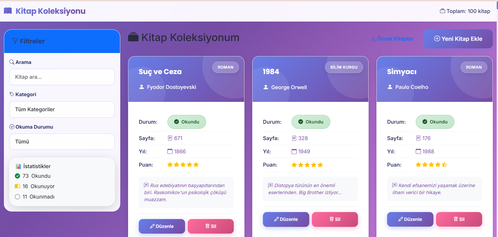
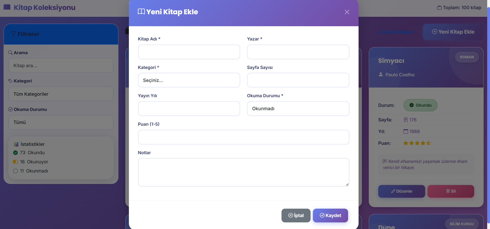

# 📚 Kitap Koleksiyonu Yöneticisi

Modern JavaScript (jQuery + Bootstrap 5) ile geliştirilmiş profesyonel kitap yönetim uygulaması.

## 🎯 Proje Hakkında

Bu proje, Web Geliştirme eğitimi kapsamında hazırlanmış tam özellikli bir kitap koleksiyonu yönetim sistemidir. Kullanıcılar kitaplarını ekleyebilir, düzenleyebilir, silebilir ve filtreleyebilirler.

## 🌟 Özellikler

### ✅ CRUD İşlemleri
- ✏️ **Ekleme**: Yeni kitap ekleme
- 📖 **Listeleme**: Tüm kitapları görüntüleme
- 🔄 **Güncelleme**: Mevcut kitap bilgilerini düzenleme
- 🗑️ **Silme**: Kitap silme

### 🎨 Gelişmiş Özellikler
- 🔍 **Arama**: Kitap adı ve yazara göre anlık arama
- 🏷️ **Filtreleme**: Kategori ve okuma durumuna göre filtreleme
- 📊 **İstatistikler**: Okunma durumu istatistikleri
- ⭐ **Değerlendirme**: 1-5 arası puan sistemi
- 📝 **Notlar**: Kitaplar için kişisel notlar
- 💾 **LocalStorage**: Verilerin tarayıcıda saklanması
- 📱 **Responsive**: Tüm cihazlarda uyumlu tasarım
- 🎨 **Glassmorphism**: Modern cam efektli tasarım
- 🌈 **Gradient Animasyonlar**: Canlı arka plan efektleri

### 🎁 Bonus: 100 Kitaplık Örnek Veri
- 📚 Dünya klasiklerinden Türk edebiyatına 100 kitap
- 🔄 İlk açılışta otomatik yükleme
- ✨ Hemen test edebilmek için hazır koleksiyon

## 🛠️ Kullanılan Teknolojiler

### JavaScript Kütüphaneleri
- **jQuery 3.7.1** - DOM manipülasyonu ve event handling
- **Vanilla JavaScript (ES6+)** - Modern JavaScript özellikleri

### CSS Framework
- **Bootstrap 5.3.2** - Modern ve responsive UI
- **Bootstrap Icons** - İkon seti
- **Custom CSS** - Özel stil düzenlemeleri

### Diğer
- **LocalStorage API** - Veri saklama
- **ES6 Modules** - Modüler kod yapısı

## 📂 Proje Yapısı

```
Book-Collection-Project/
├── components/          # UI bileşenleri
├── pages/              # Sayfa yapıları
├── interfaces/         # TypeScript benzeri interface'ler
├── utils/              # Yardımcı fonksiyonlar
│   ├── BookManager.js  # Kitap CRUD işlemleri
│   ├── UIManager.js    # UI yönetimi
│   └── FilterManager.js # Filtreleme işlemleri
├── data/               # Veri dosyaları
│   └── sample-books.json # 100 kitaplık örnek veri
├── index.html          # Ana HTML dosyası
├── Main.js             # Ana JavaScript dosyası
├── styles.css          # Premium CSS stilleri
├── package.json        # NPM konfigürasyonu
├── netlify.toml        # Netlify deployment ayarları
└── README.md           # Bu dosya
```

## 📚 100 Kitaplık Örnek Veri

Projeyi hemen test edebilmeniz için **100 kitaplık hazır koleksiyon** eklenmiştir!

### Otomatik Yükleme
- İlk açılışta otomatik olarak yüklenir
- LocalStorage boşsa devreye girer
- Hiçbir manuel işlem gerektirmez

### İçerik
- 📖 Dünya klasikleri (1984, Suç ve Ceza, vb.)
- 🇹🇷 Türk edebiyatı (Tutunamayanlar, İnce Memed, vb.)
- 🚀 Bilim kurgu (Dune, Foundation, vb.)
- 🧙 Fantastik (Yüzüklerin Efendisi, Harry Potter, vb.)
- 🔍 Polisiye (Sherlock Holmes, vb.)
- 📚 Ve daha fazlası...

## 🚀 Kurulum

### 1. Projeyi İndirin
```bash
git clone https://github.com/auy11/Book-Collection-Project.git
cd Book-Collection-Project
```

### 2. Bağımlılıkları Yükleyin (Opsiyonel)
```bash
npm install
```

### 3. Projeyi Çalıştırın

**Basit Yöntem** (Direkt HTML):
- `index.html` dosyasını tarayıcınızda açın

**Geliştirme Sunucusu ile**:
```bash
npm run dev
```

## 📸 Ekran Görüntüleri

### Ana Sayfa

*Kitap koleksiyonu ana görünümü - filtreleme ve arama özellikleri*

### Kitap Ekleme

*Yeni kitap ekleme modal formu.

> **Not**: Ekran görüntülerini `screenshots/` klasörüne ekleyin.

## 🌐 Canlı Demo

**Netlify URL**: https://shiny-rolypoly-bac3dc.netlify.app

## 📝 Kullanım

1. **Kitap Eklemek İçin**:
   - "Yeni Kitap Ekle" butonuna tıklayın
   - Formu doldurun (Kitap Adı, Yazar, Kategori zorunlu)
   - "Kaydet" butonuna tıklayın

2. **Kitap Düzenlemek İçin**:
   - Kitap kartındaki "Düzenle" butonuna tıklayın
   - Bilgileri güncelleyin
   - "Kaydet" butonuna tıklayın

3. **Kitap Silmek İçin**:
   - Kitap kartındaki "Sil" butonuna tıklayın
   - Onay verin

4. **Arama ve Filtreleme**:
   - Sol panelden arama kutusunu kullanın
   - Kategori veya okuma durumuna göre filtreleyin

## 🎓 Proje Gereksinimleri Kontrolü

- ✅ Modern JavaScript kütüphanesi: **jQuery 3.7.1**
- ✅ CSS Framework: **Bootstrap 5.3.2**
- ✅ Kurulum: jQuery ve Bootstrap CDN ile entegre
- ✅ IDE: VS Code önerilen
- ✅ Klasör yapısı: Components, Pages, Interfaces, Utils
- ✅ CRUD işlemleri: Tamamlandı
  - ✅ Ekleme (Create)
  - ✅ Listeleme (Read)
  - ✅ Güncelleme (Update)
  - ✅ Silme (Delete)
- ✅ Ekran görüntüleri: screenshots/ klasöründe
- ✅ GitHub: Public repository
- ✅ Netlify: Deployment yapılandırması hazır

## 🔧 Geliştirme

### Özellik Eklemek
1. Yeni özelliği `utils/` veya `components/` klasöründe geliştirin
2. `Main.js` dosyasında entegre edin
3. Gerekirse `index.html` ve `styles.css` dosyalarını güncelleyin

### Stil Değişiklikleri
- Bootstrap sınıflarını kullanın
- Özel stiller için `styles.css` dosyasını düzenleyin

## 📦 Deployment

### Netlify ile Yayınlama

1. **Netlify Hesabı Oluşturun**
   - [Netlify.com](https://www.netlify.com) adresine gidin
   - GitHub ile giriş yapın

2. **Projeyi Deploy Edin**
   - "New site from Git" seçeneğini seçin
   - GitHub repository'nizi seçin
   - Deploy settings otomatik algılanacaktır
   - "Deploy site" butonuna tıklayın

3. **Deploy Tamamlandı!**
   - Netlify size bir URL verecektir
   - Bu URL'i README.md dosyasına ekleyin

## 🤝 Katkıda Bulunma

1. Bu repository'yi fork edin
2. Yeni bir branch oluşturun (`git checkout -b feature/amazing-feature`)
3. Değişikliklerinizi commit edin (`git commit -m 'feat: Add amazing feature'`)
4. Branch'inizi push edin (`git push origin feature/amazing-feature`)
5. Pull Request oluşturun

## 📄 Lisans

Bu proje MIT lisansı altında lisanslanmıştır.

## 👤 Geliştirici

**auy11**

- GitHub: [@auy11](https://github.com/auy11)
- Proje: [Book-Collection-Project](https://github.com/auy11/Book-Collection-Project)

## 🙏 Teşekkürler

Bu proje Web Geliştirme eğitimi kapsamında geliştirilmiştir.

---

⭐ Bu projeyi beğendiyseniz yıldız vermeyi unutmayın!
